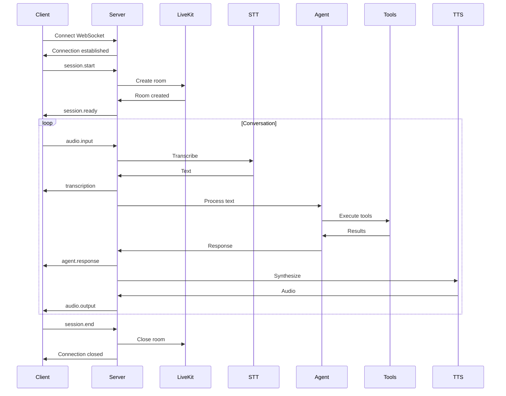

# API Documentation

## Base URL

```
Production: https://api.voice-agent.com
Development: http://localhost:8000
```

## Authentication

All API requests require authentication via Bearer token:

```http
Authorization: Bearer <token>
```

## WebSocket Endpoints

### Voice Session

#### `WS /ws/voice/session`

Establishes a real-time voice session.

**Connection URL**:
```
wss://api.voice-agent.com/ws/voice/session?token=<jwt_token>
```

**Message Types**:

##### Client → Server

```typescript
// Start session
{
  "type": "session.start",
  "data": {
    "session_id": "uuid",
    "user_id": "optional-user-id",
    "context": {
      "store_id": "shopify-store-id",
      "preferences": {}
    }
  }
}

// Send audio
{
  "type": "audio.input",
  "data": {
    "audio": "base64-encoded-audio",
    "format": "pcm16",
    "sample_rate": 16000
  }
}

// End session
{
  "type": "session.end"
}
```

##### Server → Client

```typescript
// Session established
{
  "type": "session.ready",
  "data": {
    "session_id": "uuid",
    "room": "livekit-room-name",
    "token": "livekit-token"
  }
}

// Transcription
{
  "type": "transcription",
  "data": {
    "text": "user's spoken text",
    "confidence": 0.95,
    "is_final": true
  }
}

// Agent response (text)
{
  "type": "agent.response",
  "data": {
    "text": "I found 3 running shoes that match your criteria",
    "intent": "product_search",
    "tools_used": ["search_products"]
  }
}

// Audio response
{
  "type": "audio.output",
  "data": {
    "audio": "base64-encoded-audio",
    "format": "mp3",
    "duration_ms": 3500
  }
}

// Error
{
  "type": "error",
  "data": {
    "code": "AUDIO_PROCESSING_ERROR",
    "message": "Failed to process audio input"
  }
}
```

## REST Endpoints

### Health Check

#### `GET /health`

Returns service health status.

**Response**:
```json
{
  "status": "healthy",
  "version": "1.0.0",
  "checks": {
    "api": "healthy",
    "shopify": "healthy",
    "livekit": "healthy",
    "redis": "healthy"
  }
}
```

### Session Management

#### `POST /api/sessions`

Create a new conversation session.

**Request**:
```json
{
  "user_id": "optional-user-id",
  "metadata": {
    "source": "web",
    "campaign": "summer-sale"
  }
}
```

**Response**:
```json
{
  "session_id": "550e8400-e29b-41d4-a716-446655440000",
  "token": "jwt-token-for-websocket",
  "expires_at": "2024-01-20T15:00:00Z"
}
```

#### `GET /api/sessions/:session_id`

Get session details.

**Response**:
```json
{
  "session_id": "550e8400-e29b-41d4-a716-446655440000",
  "status": "active",
  "started_at": "2024-01-20T14:00:00Z",
  "messages": [
    {
      "role": "user",
      "content": "Show me running shoes",
      "timestamp": "2024-01-20T14:00:10Z"
    },
    {
      "role": "assistant",
      "content": "I found 5 running shoes that might interest you",
      "timestamp": "2024-01-20T14:00:12Z",
      "tools_used": ["search_products"]
    }
  ],
  "context": {
    "cart_items": [],
    "viewed_products": ["prod_123", "prod_456"]
  }
}
```

#### `DELETE /api/sessions/:session_id`

End a session.

**Response**:
```json
{
  "message": "Session ended successfully",
  "duration_seconds": 180
}
```

### Product Search

#### `POST /api/products/search`

Search products (for testing/debugging).

**Request**:
```json
{
  "query": "running shoes",
  "filters": {
    "category": "footwear",
    "price_range": {
      "min": 50,
      "max": 200
    },
    "size": "10"
  },
  "limit": 10
}
```

**Response**:
```json
{
  "products": [
    {
      "id": "gid://shopify/Product/123456",
      "title": "UltraBoost Running Shoes",
      "description": "High-performance running shoes",
      "price": {
        "amount": "150.00",
        "currency": "USD"
      },
      "images": ["https://..."],
      "variants": [
        {
          "id": "variant_123",
          "size": "10",
          "color": "Black",
          "available": true,
          "inventory_quantity": 5
        }
      ]
    }
  ],
  "total_count": 15,
  "has_more": true
}
```

### Analytics

#### `POST /api/analytics/events`

Track user interactions.

**Request**:
```json
{
  "session_id": "550e8400-e29b-41d4-a716-446655440000",
  "event_type": "tool_execution",
  "data": {
    "tool_name": "search_products",
    "parameters": {
      "query": "shoes"
    },
    "duration_ms": 250,
    "success": true
  }
}
```

**Response**:
```json
{
  "event_id": "evt_789",
  "timestamp": "2024-01-20T14:00:00Z"
}
```

#### `GET /api/analytics/sessions/:session_id`

Get session analytics.

**Response**:
```json
{
  "session_id": "550e8400-e29b-41d4-a716-446655440000",
  "metrics": {
    "duration_seconds": 180,
    "messages_count": 10,
    "tools_executed": 5,
    "products_viewed": 3,
    "cart_value": 150.00
  },
  "tool_usage": {
    "search_products": 3,
    "get_product_details": 2
  },
  "intents": ["product_search", "price_inquiry", "add_to_cart"]
}
```

## Error Handling

All errors follow this format:

```json
{
  "error": {
    "code": "ERROR_CODE",
    "message": "Human-readable error message",
    "details": {
      "field": "additional context"
    }
  }
}
```

### Error Codes

| Code | Description | HTTP Status |
|------|-------------|-------------|
| `UNAUTHORIZED` | Invalid or missing auth token | 401 |
| `FORBIDDEN` | Insufficient permissions | 403 |
| `NOT_FOUND` | Resource not found | 404 |
| `VALIDATION_ERROR` | Invalid request data | 400 |
| `SHOPIFY_API_ERROR` | Shopify API failure | 502 |
| `LIVEKIT_ERROR` | LiveKit connection issue | 502 |
| `RATE_LIMIT_EXCEEDED` | Too many requests | 429 |
| `INTERNAL_ERROR` | Server error | 500 |

## Rate Limiting

Default rate limits:

- **Session creation**: 10 per minute per IP
- **WebSocket messages**: 100 per minute per session
- **API requests**: 1000 per hour per token

Rate limit headers:

```http
X-RateLimit-Limit: 1000
X-RateLimit-Remaining: 999
X-RateLimit-Reset: 1642680000
```

## WebSocket Connection Lifecycle



## SDK Examples

### JavaScript/TypeScript

```typescript
import { VoiceAgentClient } from '@voice-agent/sdk';

const client = new VoiceAgentClient({
  apiKey: 'your-api-key',
  baseUrl: 'https://api.voice-agent.com'
});

// Create session
const session = await client.createSession();

// Connect WebSocket
const ws = client.connectVoice(session.token);

ws.on('transcription', (data) => {
  console.log('User said:', data.text);
});

ws.on('agent.response', (data) => {
  console.log('Agent:', data.text);
});

// Send audio
ws.sendAudio(audioBuffer);

// End session
ws.close();
```

### Python

```python
from voice_agent import VoiceAgentClient

client = VoiceAgentClient(
    api_key="your-api-key",
    base_url="https://api.voice-agent.com"
)

# Create session
session = client.create_session()

# Connect WebSocket
async with client.connect_voice(session.token) as ws:
    # Handle messages
    async for message in ws:
        if message.type == "transcription":
            print(f"User: {message.data.text}")
        elif message.type == "agent.response":
            print(f"Agent: {message.data.text}")
    
    # Send audio
    await ws.send_audio(audio_data)
```

## Testing

### Test Endpoint

```
POST /api/test/tool-execution
```

Execute a tool directly for testing:

```json
{
  "tool": "search_products",
  "parameters": {
    "query": "shoes"
  }
}
```

### WebSocket Testing

Use wscat for testing:

```bash
wscat -c wss://api.voice-agent.com/ws/voice/session \
  -H "Authorization: Bearer <token>"
```